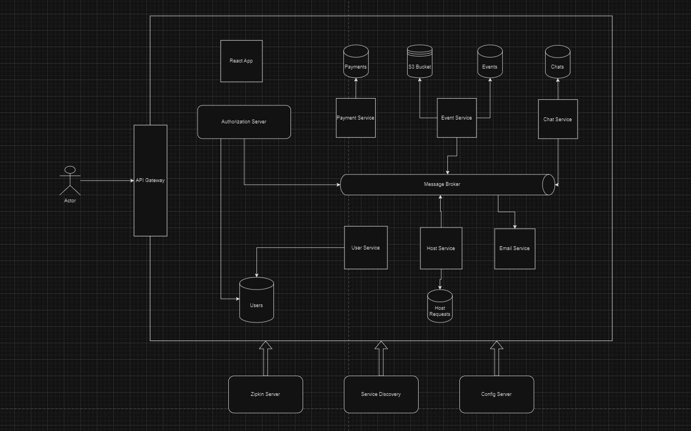

# CrowdCraft - Event Management Web Application

CrowdCraft is a comprehensive platform designed to simplify event organization and management. It provides a range of features to streamline event planning, event organization and event participation.

## Features

- Browse and explore a wide range of events from different hosts and also get an opportunity to be part of the organising team.
- Customized Authorization server that ensures OAuth2.0 security for the system.
- Implemented an S3 bucket to ensure robust image storage and management, enhancing the application's image handling capabilities.
- User-friendly interface for seamless navigation.
- Backed by the robust functionality of Spring Boot.
- Stripe payment gateway with enhanced security measures to ensure secure and reliable payment processing.
- Utilized WebSocket technology to implement group chat functionality, enabling real-time communication and collaboration among users.

### User-side Features
- **Event Participation:**
    - Explore and participate from a diverse collection of events.

- **Event Organization:**
    - Explore and be a part of the organization team and help different communities. Get a chance to earn rewards based on the event type.
    - Chat with different organizers within the same organization team.
    - Send images option in the chat communication.

- **Password Management:**
    - Forgot password? Reset it via OTP sent to the registered email ID.
    - Change user details, including password, in the user profile section.

- **Secured Payment:**
    - Secure your translations using a secured payment gateway lik Stripe.

- **Host Registration:**
    - Change the role to Host and conduct the events.
    - Be an host after getting the approval from the admin.

### Host-side Features
- **Event Management:**
    - Register events and get a team for organising it if required.
    - Make events "Live" from "Organizing" to get participants.
    - Option to change the event details till the Event moves to "Live" Status.
    - Event cancellation option.

- **Job Management:**
    - View, Accept and Reject the job request to build the organization team.

- **Chat Management:**
    - Chat with multiple organization teams and discuss the organization details.
    - Send Images option in the chat option.

## Architecture

The CrowdCraft follows a microservices architecture, which involves breaking down the application into smaller, independent services that communicate with each other over well-defined APIs. This architectural approach was chosen for several reasons:

1. **Scalability**: By dividing the application into smaller services, each service can be scaled independently based on its specific requirements. This allows me to handle varying loads more efficiently and ensures that resources are used optimally.
2. **Flexibility**: Microservices allow for greater flexibility in development and deployment. Each service can be developed, tested, and deployed independently, which reduces the risk of introducing errors and speeds up the development process.
3. **Maintainability**: With microservices, each service is responsible for a specific set of functionalities, making it easier to maintain and update the application. Changes to one service do not require changes to other services, reducing the risk of unintended side effects.
4. **Resilience**: Microservices improve the overall resilience of the application. If one service fails, it does not necessarily impact the entire application, as other services can continue to function independently.

Here is the system design I have implemented for this application.



## Technologies Used

- **Backend:** Spring Boot,Spring Cloud
- **Database:** MySQL, MongoDB
- **Security:** Spring Security, OAuth2.0
- **Frontend:** ReactJS, Redux, Tailwind CSS
- **Payment Gateway:** Stripe
- **Message Broker:** Apache Kafka
- **Dependencies:** Spring Config Server, Eureka Server, Zipkin
- **Image Storage:** Amazon S3 Bucket

For **Production related information**, see the [production branch](../../tree/production-changes).

## Getting Started
1. **Clone the repository:**
    ```bash
    git clone https://github.com/Samallll/Waves.git
    ```

2. **Basic Setup:**
- Select the main branch and create an `application-dev.yml` file.

3. **External Configuration:**
  - update the `application-dev.yml` file by comparing it with the `application-prod.yml` file in the repository.

4. **Database Setup:**
  - Create a MySQL database and update the `application-dev.yml` file with your database configurations.
  - Create a MongoDB database and update the `application-dev.yml` file with your database configurations.
  - Create required databases for the application in the database servers.

5. **Setup Zipkin:**
  - Setup Zipkin Distributed Tracing tool in the system.

6. **Configure Apache Kafka:**
  - Setup Message Broker in the system and create the topics named : email, add-chat-user, create-chat-room, update-chat-room, update-chat-room, participation-email, host-request-approved

6. **Run Services:**
- Run Authorization server, Service Registry and API Gateway then continue with other services.

7. **Run Front End Application:**
- Run Front End React Application on port number 3000

8. **Run Services:**
  - Open your web browser and go to `http://127.0.0.1:8090`

Note: I executed each services whenever its required, but it's better to create separate containers for services and install the dependencies in the docker environment.

### Running the Application
After configuring the `application-dev.yml` file, you're ready to run the application. Follow the steps in the [Getting Started](#getting-started) section to clone the repository and launch the application.

Feel free to reach out if you encounter any issues during the configuration process.
