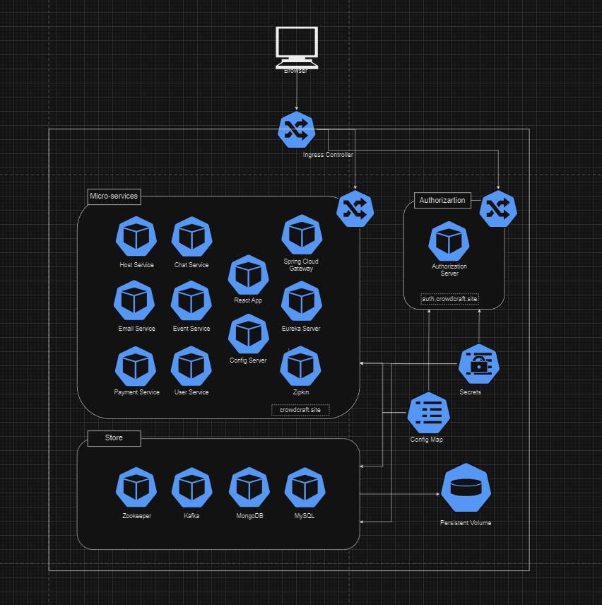

# Production Changes

## Overview

This branch contains changes that are specific to the production environment. It includes updates and enhancements that have been deployed to the live production system.

## Recent Changes

- **Enhanced Security Measures**: Implemented additional security measures to protect user data and prevent unauthorized access.
- **Bug Fixes**: Resolved several bugs and issues reported in the production environment to ensure smooth operation.

## Technologies used

- **Containerization:** Docker
- **Orchestration:** Kubernetes
- **Blob Storage:** AWS S3
- **Cloud Provider:** Digital Ocean

## Cluster Information

This section provides an overview of the Kubernetes cluster deployed. We have three namespaces:

- authorization: This namespace consists of authorization server which will implement the oauth2.0 based security.
- store: This namespace consists of components which will be used to store details.
- micro-services: This namespace consists of backend components and the front end react app.

Here is the diagram which shows the namespace classification:

**Note:**
1. If necessary, create secrets separately for each pod.
2. Configure an ingress controller for domain-based access to the website.
3. Integrate Certbot if the application require secure connections only.

Feel free to reach out if you encounter any issues during the configuration process.

